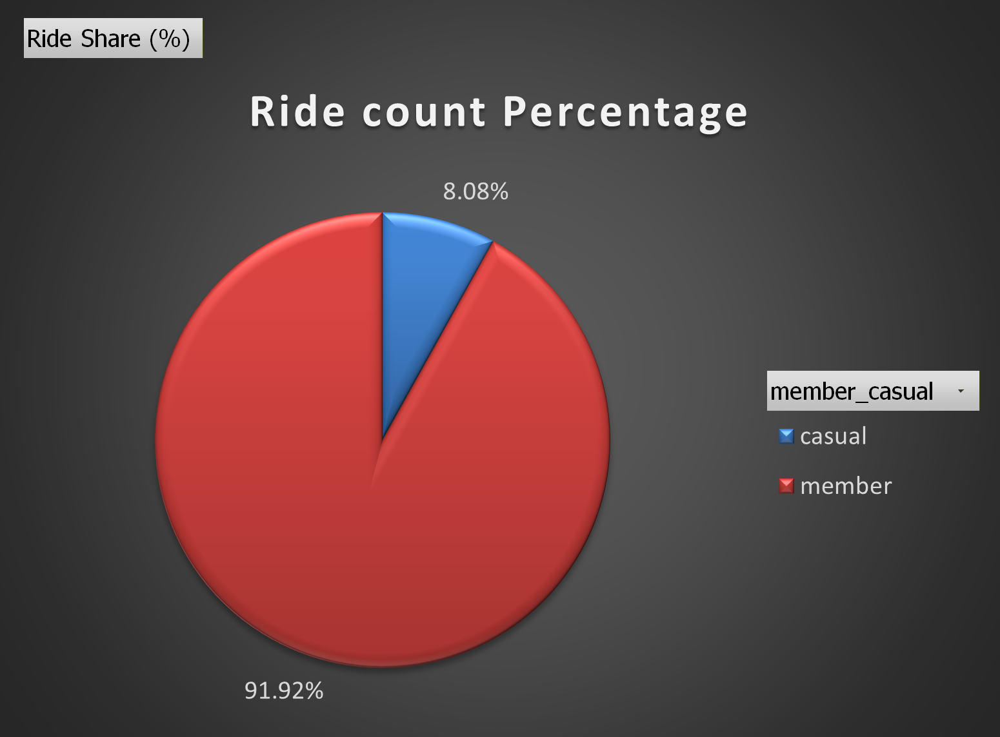
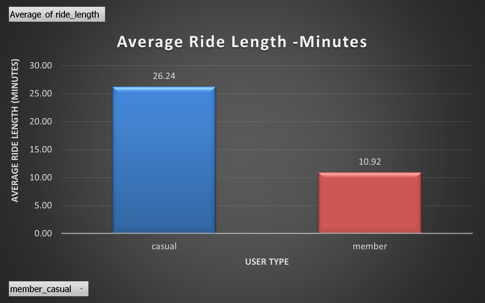
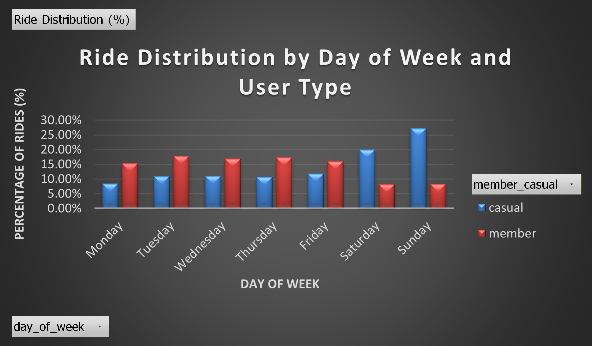
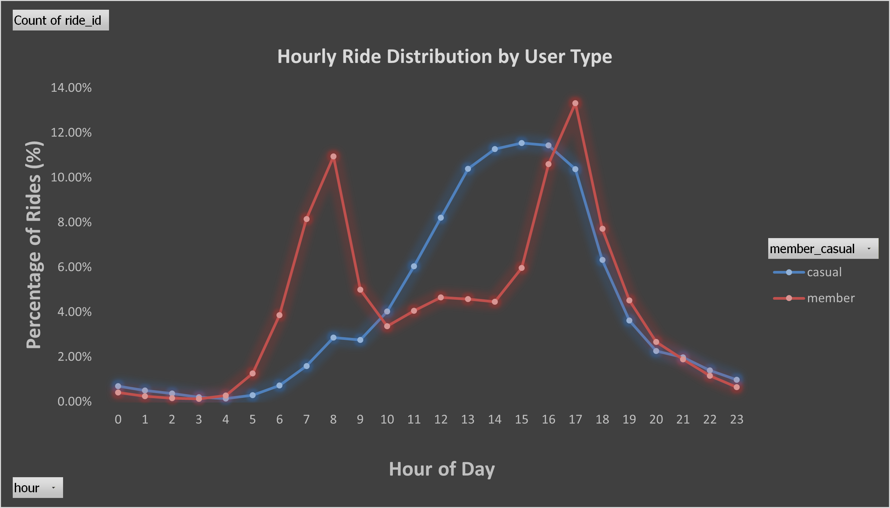

# 🚲 Cyclistic Bike-Share Analysis

### Strategic Analysis of User Behaviour for Membership Conversion

---

## 📌 Project Overview

This project performs an end-to-end data analysis of Cyclistic (Divvy Bike Share) trip data to identify behavioral differences between **casual riders** and **annual members**.

The objective is to generate actionable insights that support **membership conversion strategies**, improving long-term revenue stability.

---

## 🎯 Business Problem

Cyclistic’s business model depends on increasing the number of annual members.

The key analytical question addressed:

> **How do casual riders and members use Cyclistic bikes differently, and how can these insights inform targeted conversion strategies?**

---

## 📊 Dataset

* **Source:** Divvy Bike Share
* **Period:** 2019 Q1 & 2020 Q1
* **Records:** ~791,000 (cleaned to ~778,000)
* **Format:** CSV (provided as compressed ZIP files)

### Key Fields:

* Ride timestamps (start/end)
* Station information
* Ride duration
* User classification (Member / Casual)

---

## ⚙️ ETL Pipeline (Python)

A structured ETL pipeline was implemented using **Pandas** to ensure data quality, consistency, and reproducibility.

### 🔹 Extraction

* Loaded multiple datasets (2019 & 2020)
* Identified schema inconsistencies

### 🔹 Transformation

* Standardized column naming conventions
* Converted datetime fields
* Merged datasets into a unified dataframe

### 🔹 Feature Engineering

* `ride_length` (minutes)
* `day_of_week`
* `hour`
* `time_period` (Morning / Afternoon / Evening / Night)
* `ride_category` (Short / Medium / Long)

### 🔹 Cleaning

* Removed invalid and negative durations
* Filtered extreme outliers (> 90 minutes)
* Standardized user types into:

  * **Member**
  * **Casual**

The pipeline was designed with a focus on **reproducibility and structured data processing**, aligning with data engineering best practices.

---

## 📈 Exploratory Data Analysis

The analysis explores user behavior across multiple dimensions:

* Ride volume distribution
* Average ride duration
* Weekly usage patterns
* Hourly ride trends
* Time-of-day segmentation
* Ride length categorization

---

## 📊 Key Visual Insights

### Ride Distribution

<p align="left">
  
</p>

### Average Ride Length

<p align="left">
  
</p>

### Weekly Usage Pattern

<p align="left">
  
</p>

### Hourly Usage Pattern

<p align="left">
  
</p>

---

## 🔍 Key Findings

* **Members dominate ride volume (~92%)**, indicating strong adoption among regular users
* **Casual riders take longer trips (~26 min vs ~11 min)**, suggesting leisure usage
* **Members ride during weekdays**, aligned with commuting behavior
* **Casual users peak on weekends and afternoons**, indicating recreational usage
* **Members prefer short rides**, while casual users engage more in medium/long rides

---

## 💡 Business Recommendations

* 🎯 Target casual riders during **weekends and afternoons**
* 🎯 Introduce **membership discounts for long-duration users**
* 🎯 Offer **ride bundles or trial memberships**
* 🎯 Design campaigns around **leisure usage patterns**

---

## 📁 Dashboards & Outputs

* 📈 **Tableau Dashboard**: Available in `/results/`
* 📊 **Excel Dashboard**: [View on Google Drive](https://docs.google.com/spreadsheets/d/1FFkyD4qh74p4Z9GKBIELzyRPFqUm7nsd/edit?usp=drive_link&ouid=105860754497024281787&rtpof=true&sd=true)
* 📑 **Final Report**: `/reports/Cyclistic_Bike-Share_Report.pdf`
* 🎥 **Presentation**: `/results/Cyclistic_Bike-Share_Presentation.pptx`

---

## 📂 Repository Structure

```text
cyclistic-bike-share-analysis/
├── README.md
├── data/
│   ├── processed/
│   └── raw/
├── notebooks/
│   └── Cyclistic_Bike-Share_etl_eda.ipynb
├── reports/
├── results/
│   ├── charts/
│   ├── *.twbx
│   └── *.pptx
└── .gitignore
```

---

## ▶️ How to Run

1. Extract datasets from `/data/raw/`
2. Open the notebook:
   `notebooks/Cyclistic_Bike-Share_etl_eda.ipynb`
3. Install dependencies:
   `pip install pandas numpy matplotlib`
4. Run all cells to reproduce the analysis

---

## 🛠 Tools & Technologies

* **Python (Pandas, NumPy)** — ETL & Analysis
* **Excel** — Pivot Tables & Business Analysis
* **Tableau** — Data Visualization
* **Jupyter Notebook** — Workflow execution

---

## 📌 Project Outcome

This project demonstrates:

* End-to-end data analytics workflow
* Structured ETL pipeline development
* Feature engineering for behavioral analysis
* Multi-tool data visualization
* Business-focused insight generation

---

## 🚀 Future Enhancements

* Migration to cloud-based architecture (GCP / BigQuery)
* Automated ETL pipelines
* Real-time streaming analysis
* Predictive modeling for user conversion

---

## 👤 Author

**Deepan Mehta**
Data Analytics → Data Engineering

---
